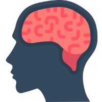

<!DOCTYPE html>
<html lang="en" dir="ltr">
  <head>
    <meta charset="utf-8">
    <title>Kellon Ko - Web Developer</title>
    <link rel="stylesheet" href="css/styles.css">
    <link rel="icon" href="css/favicon.ico">
    <link rel="preconnect" href="https://fonts.googleapis.com">
    <link rel="preconnect" href="https://fonts.gstatic.com" crossorigin>
    <link href="https://fonts.googleapis.com/css2?family=Merriweather&family=Montserrat&family=Sacramento&display=swap" rel="stylesheet">
  </head>
  <body>
    

      
      <h1>I'm Kellon,</h1>
      <h2>a web developer.</h2>
      
      
    

    

      

        
        <h2>Hi.</h2>
        
I am a web developer based in Los Angeles, California. 
          During my free time, you'll find me cooking, exercising, watching basketball,  
          playing video games, or reading psychology studies.

      

      

      

        <h2>Skills.</h2>
        

          
          <h3>Design and Develop.</h3>
          
I'm a back-end developer, working to eventually  
            become a full-stack developer. 
             I can design and help create your website using  
             the latest technologies available.

        

        

          
          <h3>Typing.</h3>
          
I can type 126 wpm with 100% accuracy!

        

      

      

        <h2>Education.</h2>
        
          
I received my Bachelor's in Psychology from University of California, Riverside in 2018. 
             During my senior year, I successfully ran and published my own study. 
            If you're interested, you can read about it <a class="footer-link" href="https://escholarship.org/content/qt7bh9x216/qt7bh9x216.pdf">here.</a>

        

      

      

        <h2>Get In Touch</h2>
        
I am currently available for freelance work.

        
If you have a project in mind, or if you would just like to chat, feel free to reach out!
  
        <a class="btn" href="mailto:kellondavidko@gmail.com">Contact Me</a>
      

    

    

      
© 2022 Kellon D. Ko. All rights reserved.

    

  </body>
</html>
